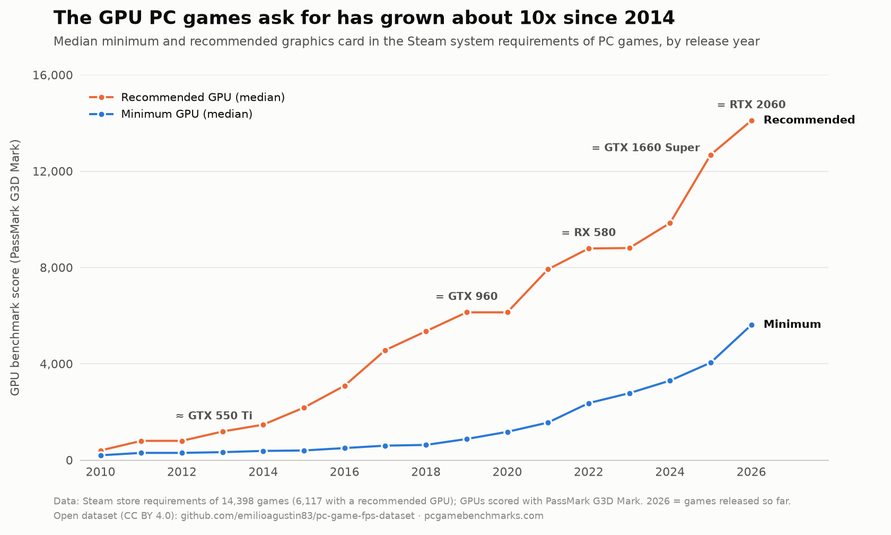

# PC Game System Requirements & Estimated FPS by GPU

System requirements for **17,400+ PC games** and **estimated 1080p frame rates on 12 reference GPUs**, from integrated graphics (Intel Iris Xe, Radeon 780M) to the RTX 4090, plus benchmark scores for **1,381 GPUs**.

The data comes from [PCGameBenchmarks](https://pcgamebenchmarks.com), a free FPS calculator for PC games. Every row links to its page on the site, which has the full breakdown at 1080p, 1440p and 4K for the Low, Medium, High and Ultra presets.

Also on [Hugging Face](https://huggingface.co/datasets/pcgamebenchmarks/pc-game-system-requirements-fps), on [Zenodo](https://doi.org/10.5281/zenodo.23162308) (DOI 10.5281/zenodo.23162308) and on Kaggle: [PC Game System Requirements & Estimated FPS by GPU](https://www.kaggle.com/datasets/emiliodeagustn/pc-game-system-requirements-and-estimated-fps-by-gpu).

## Files

### `data/games.csv` (17,427 rows)

| Column | Description |
|---|---|
| `name` | Game title |
| `release_year` | First release year |
| `steam_appid` | Steam app ID, when the game is on Steam |
| `min_gpu`, `min_cpu`, `min_ram_gb` | Minimum requirements as listed on the game's Steam store page |
| `rec_gpu`, `rec_cpu`, `rec_ram_gb` | Recommended requirements as listed on Steam (empty when the store page has none) |
| `min_gpu_g3d`, `rec_gpu_g3d` | G3D benchmark score of the minimum / recommended GPU, resolved from the requirement text |
| `engine_fps_cap` | Frame cap of the game engine, when there is one (e.g. 60 for Skyrim) |
| `fps_1080p_high_<gpu>` | Estimated average FPS at 1080p, High preset, on each reference GPU (capped at 360 and at the engine cap) |
| `page_url` | Page with the full FPS table for the game |

Reference GPUs: Intel Iris Xe, Radeon 780M, GTX 1650, GTX 1660 Super, RTX 3060, RX 7600, RTX 4060, RTX 5060, RTX 4070, RX 7800 XT, RTX 5070, RTX 4090.

### `data/gpus.csv` (1,381 rows)

| Column | Description |
|---|---|
| `name` | GPU name |
| `type` | Desktop, Mobile, Desktop/Mobile or Unknown |
| `g3d_mark` | G3D benchmark score |
| `page_url` | Page listing the games the GPU can run and at what FPS |

### `notebooks/`

- `which-gpu-for-60-fps.ipynb`: which GPU you need for 60 FPS in 2026, and how fast system requirements have grown.
- `gpu-requirements-by-year.py`: median minimum and recommended GPU in Steam requirements by release year (chart below).

## How the FPS estimates are made

Each game gets a baseline from its Steam minimum (and recommended) GPU and its category (esports, indie, AAA, demanding AAA). The FPS on a GPU is that baseline scaled by the GPU's benchmark score along a fitted curve, with separate multipliers for resolution and quality preset. The model is calibrated against **2,070 measured benchmark results** from GameGPU and Notebookcheck (desktop GPUs, integrated graphics, and games from 2007 to 2026): a typical estimate lands within about 30% of the measured result (about 40% on integrated GPUs), with no bias towards any GPU tier.

They are **estimates, not measurements**: real FPS also depends on the CPU, RAM, drivers, game patches and the scene, and they do not include ray tracing, upscaling or frame generation. Treat them as "what to expect", not as benchmark results.

The full method, with every constant and its limits, is documented at **[pcgamebenchmarks.com/methodology](https://pcgamebenchmarks.com/methodology)**.

## Use it for

- "Can my GPU run it?" tools and recommendations
- How system requirements have grown over the years
- Comparing how much GPU each game genre needs
- Picking a GPU for the games you play

## License and attribution

[CC BY 4.0](LICENSE): free to use, share and adapt, including commercially, with attribution to **PCGameBenchmarks (https://pcgamebenchmarks.com)**. Requirement texts are as published on each game's Steam store page.

To cite it, see [`CITATION.cff`](CITATION.cff) (GitHub shows a "Cite this repository" button).

## Updates

Snapshot of 5 October 2026. The site adds new releases daily; this repository and the Kaggle dataset are refreshed periodically.

Found a wrong figure or requirement? Report it at [pcgamebenchmarks.com/contact](https://pcgamebenchmarks.com/contact).
